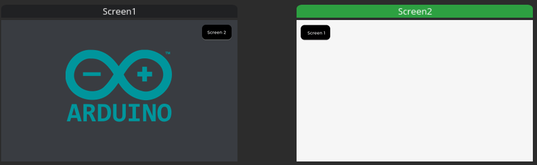

# Waveshare ESP32S3 Touch LCD 4.3 inch 
Basic setup using SquareLine Studio / Arduino with an Waveshare ESP32S3 Touch LCD 4.3 inch.  
Minimal dependencies.
LVGL 8.3.x

## Basic example files : 

`waveshare_ESP32S3_TouchLCD4.3_basic_example`: Arduino example    

`esp32_s3_lcd_4.3_waveshare_v1_0 ` : Square line board config to put in *\SquareLine Studio x.x.x\boards\espressif* as specified in this [wiki](https://docs.squareline.io/docs/obp/)  

`basicESP32S3_SquareLine_Project  ` : SquareLine project  

`lv_conf.h` : Configuration header file for LVGL to put in *Arduino/libraries*   
Original file [from waveshare](https://www.waveshare.com/wiki/ESP32-S3-Touch-LCD-4.3#Arduino) (disable corner label : LV_USE_MEM_MONITOR = 0)

> [!NOTE]
> Arduino Board configuration : **Flash (8MB)** / **PSRAM (8MB OPI)** / **ESP32S3 Dev Module** as specified [here](https://www.waveshare.com/wiki/ESP32-S3-Touch-LCD-4.3#Arduino)  
> Board manager version : **esp32 by ESpressif 3.0.3**  
> Libraries versions : **lvgl by kisvegador 8.3.6** / **LovyanGFX by lovyan03 1.1.16**
>
> Square line export files in folders so files must be copy paste in the same files as the .ino. [Trick to explore.](https://forum.squareline.io/t/export-ui-files-to-arduino/1398/3)  
***

HMI looks like this:

Sources :  
https://github.com/Westcott1/Waveshare-ESP32-S3-Touch-LCD-4.3-and-Arduino  
https://www.waveshare.com/wiki/ESP32-S3-Touch-LCD-4.3#Arduino  
https://github.com/FCam1/SC01_Plus_HMI_example
